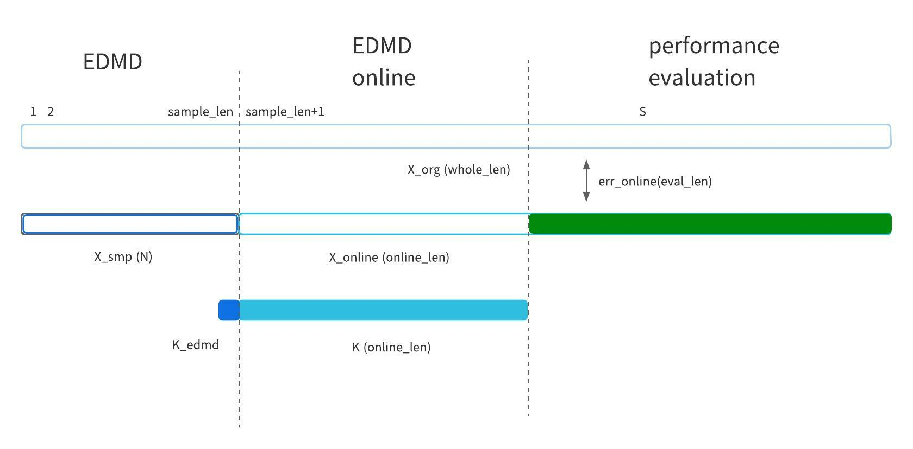

# EDMD ONLINE
toy data test for evaluation of EDMD online

## Usage
first, choose toy data type in `SymConfig.m`.
* linear_time_variant
* nonlinear_sin_rot

is available for now.

next, in matlab console, type command in below order.

1. init
2. create
3. online
4. only
5. plot

### init
setpath and set warning off

### crate
crate toy data

### online
Applying EDMD online algorithm for created toy data

### only
Applying EDMD algorithm(__only__) for created toy data

### plot
1. plot RMSE transition between toy data and estimated data with EDMD online
2. plot trajectory below
   1. toy data
   2. estimated data with EDMD(__only__)
   3. estimated data with EDMD online


### data definition


## File Structure
```
.
├── create_toy_data.m
├── data
│  ├── result
│  │  ├── linear_time_variant.mat
│  │  └── nonlinear_sin_rot.mat
│  └── toy_data
│     ├── linear_time_variant.mat
│     └── nonlinear_sin_rot.mat
├── DICTOL                                                          // csc Library
├── images
│  ├── algorithm.jpeg
│  ├── edmd_online.jpeg
│  ├── linear_time_variant_trajectory.jpg
│  ├── linear_time_variant_transition.jpg
│  ├── nonlinear_sin_rot_rmse.jpg
│  └── nonlinear_sin_rot_trajectory.jpg
├── main.m
├── plot.m
├── README.md
├── SymConfig.m
├── time_evolution
│  ├── linear_time_variant.m
│  └── nonlinear_sin_rot.m
├── util_edmd_online
│  ├── dmd.m
│  ├── mat_to_mat_tilde.m
│  ├── mat_to_vec_check.m
│  ├── next_mat_K.m
│  └── projection_onto_range_mat.m
└── util_plot
   ├── error_transition.m
   └── rmse.m

```

<!-- + main.m: main file for toy data test
+ util: utility function defined on this directory
    + dmd.m: dynamic mode decomposition
    + time_evolutions2d.m: define time evolution function on state space
    + mat_to_mat_tilde.m: convert matrix to matrix tilde (big matrix)
    + mat_to_vec_check.m: convert matrix to vector
+ images: images directory
+ archive: archive directory using nonlinear mapping(state space <-> feature space)
    + utility functions for _main.m
        + nonlinear_mapping.m: define nonlinear mappnig from state space to feature space
        + nonlinear_mapping_inv.m: define nonlinear mapping from feature space to state space
        + time_evolution.m: define time evolution function on state space
+ plot: functions defined for plot
    + error_transition.m: return rmse corresponding to iteration
    + rmse.m: define rmse(root square mean eror) between 2 matrices
+ DCTORL: csc library -->

+ detail later...

## csc
+ convolutional sparse coded(dictionary learning)
+ D(Dictionary): mapping from feature space to state space

## DICTOL
* [githb link](https://github.com/tiepvupsu/DICTOL)
