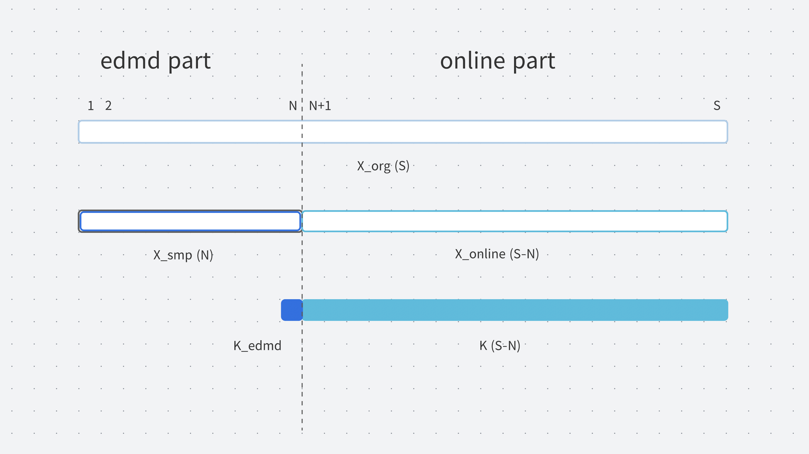

# Toy Data Test
toy data test for evaluation of EDMD online

## detail
1. EDMD part
2. EDMD online part

### EDMD part
+ standard EDMD
+ preparation for EDMD online part

### EDMD online part
+ update time evoluetion mapping on feature space
+ the initial mapping on feature space is determined in standard EDMD

### data definition


## File Structure
```
.
├── dmd.m
├── images
│  └── data_definition.png
├── main.m
├── mat_to_mat_tilde.m
├── mat_to_vec_check.m
├── nonlinear_mapping.m
├── nonlinear_mapping_inv.m
├── README.md
└── time_evolution.m
```
+ main.m: main file for test
    + define constant values
    + define original data and sampled data on state space
    + EDMD
    + EDMD online (not included)
+ dmd.m: define dynamic mode decomposition
+ time_evolution.m: define time evolution function on state space
+ nonlinear_mapping.m: define nonlinear mappnig from state space to feature space
+ nonlinear_mapping_inv.m: define nonlinear mapping from feature space to state space
+ mat_to_mat_tilde.m: convert matrix to matrix tilde (big matrix)
+ mat_to_vec_check.m: convert matrix to vector
+ images: images directory

## feature-csc
+ convolutional sparse coded(dictionary learning)

<!-- $$ \mathrm{argmin}_{\tilde{K} \in \mathbb{R}^{L \times L}} $$ -->